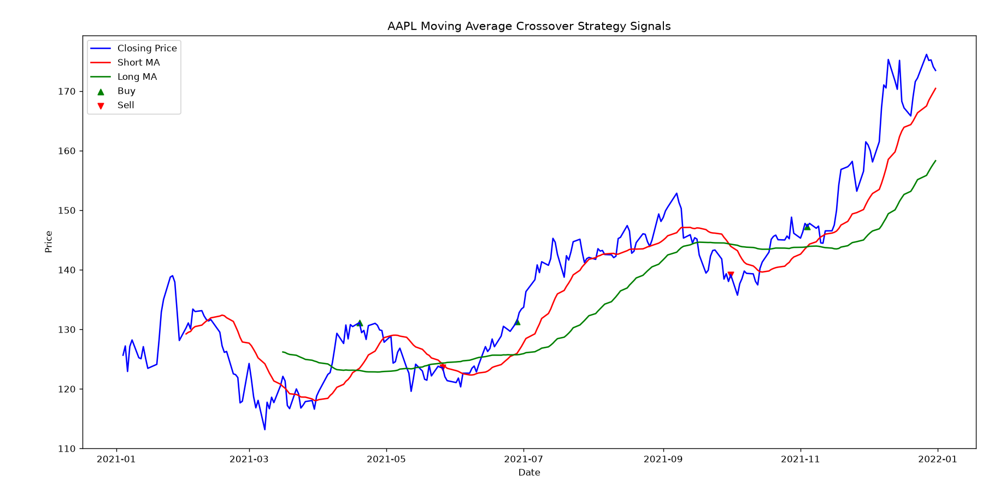
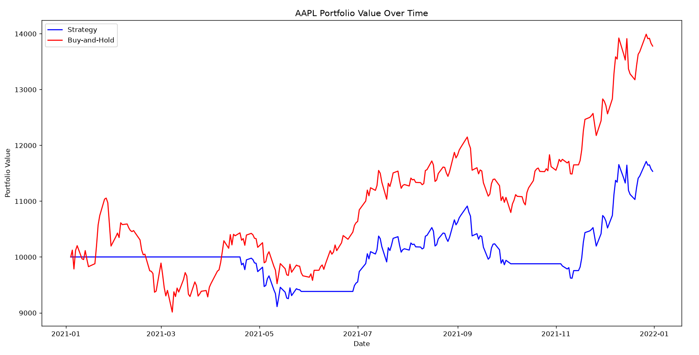
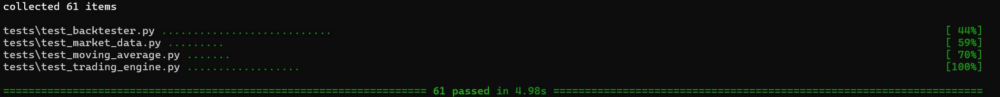

# trading-backtester

A Python backtesting application for simulating and evaluating trading strategies using real-life historical market data.

## Overview

This is a CLI trading strategy performance analysis program. Real-life historical market data is fetched using yfinance. The moving-average strategy then generates buy and sell signals from the historical data. The backtester then executes each signal at the next trading session’s opening price. One chart displays closing prices, moving averages and generated signals, while another compares the strategy’s portfolio value against a buy-and-hold benchmark.

## Features

- User input for stock ticker, start date, end date, short trading window, long trading window, and starting balance.
- Retrieval of historical market data using yfinance.
- Functional trading engine to buy and sell shares.
- Moving average crossover trading strategy.
- Trading strategy and buy-and-hold performance evaluation
- Visualisation of portfolio performance and backtesting on graphs using matplotlib.

## Requirements

- Python 3.x (with venv) including the packages contained in **requirements.txt**

## Installation and Usage

Using Windows PowerShell and a stable internet connection:
- Clone the repository
- Set up a Python venv (run **python -m venv venv**, and then **.\venv\Scripts\Activate.ps1**)
- Install the requirements (run **pip install -r requirements.txt**)
- Run **python -m src.main**

## Moving Average Strategy

The moving-average crossover strategy uses two rolling averages of the stock’s closing price: a short moving average and a long moving average. A buy signal is generated when the short average crosses above the long average, and a sell signal is generated when it crosses below. Otherwise, no trade signal is generated. The user selects both window sizes, with the short window smaller than the long window. Signals are only generated once sufficient historical data exists to compare both averages across consecutive trading sessions.

## Backtesting

The backtester processes the historical data in chronological order and executes each signal at the next trading session’s opening price. This ensures that trades occur after the closing price data needed to generate the signal becomes available. A buy signal purchases as many whole shares as the available balance allows, retaining any leftover cash, while a sell signal sells all shares currently held. At each session’s close, the total portfolio value is calculated from the remaining cash and the closing value of held shares. Signals generated on the final session are not executed because no subsequent opening price is available. This helps depict what a accurate real-life use of the strategy would look like.

## Buy-and-hold Benchmark

As well as testing the trading strategy in the given timeframe, a buy-and-hold benchmark is also calculated. This is the value that the portfolio would be at if as many whole shares as possible were bought at the start of the window (first closing price) and held for the duration, retaining any leftover cash. The value is taken at every 'Close' and plotted onto the portfolio graph to be compared to the strategy.

## Visualisation

To visualise the performance data I used the Python library matplotlib. On the first graph, stock closing price, short moving average, and long moving average are plotted on a Price-Time graph. In addition to this, the buy and sell signals are plotted as scatter markers to indicate where the buy and sell signals were generated.

On the second graph, the trading strategy's portfolio performance is plotted as well as the buy-and-hold performance on a Portfolio-value-Time graph. This graph models the trading strategy's overall performance on that stock over the selected timeframe.

## Testing

The application includes automated tests using pytest to verify core functionality.

### Features Tested

- Running backtesting
- Fetching market data
- Moving average strategy calculations and signals
- Trading engine operations
- Calculations involving buy-and-hold
- Error Handling for invalid inputs

Run the tests from the project root (run **python -m pytest**):

The tests report, **61 tests, passing in 4.98 seconds**.

## Assumptions and Limitations

- **No transaction fees or slippage:** Trades execute at the recorded opening price without fees or any difference between the assumed and actual execution price. These costs could reduce returns in real trading.
- **Whole shares only:** The program does not support buying fractional shares, so any remaining balance stays as cash.
- **No short selling:** The program only buys shares and sells shares already held. It does not support selling borrowed shares to profit from falling prices.
- **Historical performance does not guarantee future results:** The backtest measures how the strategy performed on historical data. Its performance may differ under future market conditions.
- **Single stock backtesting:** Each backtest uses one stock, this is for the most part unrealistic. The program does not currently model a diversified portfolio.

## Possible Improvements

- **Transaction fees and slippage:** Include trading costs and execution price differences to make the simulation more realistic.
- **Additional strategies:** Allow users to choose between different trading strategies and explore their performance under different market conditions.
- **Strategy performance comparison:** Run multiple strategies on the same historical data and starting balance, comparing their portfolio values and returns.
- **Multi-stock portfolios:** Allow users to allocate their starting balance across multiple stocks and track the combined portfolio value.